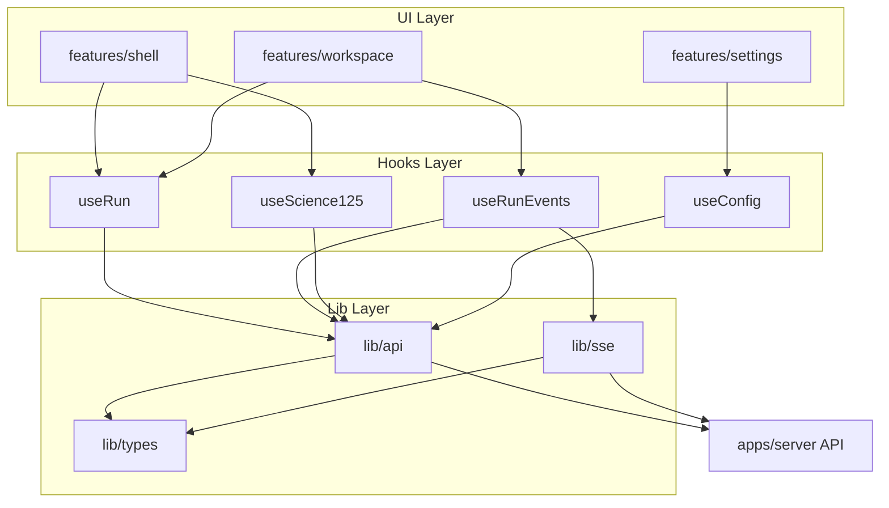

# apps/web 架构（C2a）

> 栈：React Router 8.3 SPA（`ssr: false`），Vite 8 dev/build，Emotion 11（`@emotion/react` + `@emotion/styled`）。生产由 Elysia 同端口托管 `dist/client`（`LUUP_WEB_DIST` 默认 `apps/web/dist/client`）。

## 分层与依赖

**只允许向下依赖**：`routes/features` → `hooks` → `lib/api|lib/sse` → `lib/types`。

```text
┌─────────────────────────────────────────────────────────┐
│  app/routes + features/{shell,workspace,settings}     │  UI（C3/C4）
├─────────────────────────────────────────────────────────┤
│  hooks/  useRun · useRunEvents · useScience125 · useConfig │
├─────────────────────────────────────────────────────────┤
│  lib/api/          fetch client, ApiError, auth header  │
│  lib/sse/          EventSource, event taxonomy          │
├─────────────────────────────────────────────────────────┤
│  lib/types/        wire types（对齐 projection.ts）     │
└─────────────────────────────────────────────────────────┘
         │ fetch / EventSource
         ▼
   apps/server HTTP + SSE（不变）
```



**禁止**：`apps/web` 任何文件 `import` `apps/server/**`。

## 模块边界

| 模块                  | 职责                                          | 不做什么          |
| --------------------- | --------------------------------------------- | ----------------- |
| `lib/types/`          | 手写 wire types + 常量（`ROLE_ORDER` 等）     | 业务逻辑、fetch   |
| `lib/api/`            | HTTP 封装、JSON 解析、`ApiError`、Bearer 注入 | DOM、React state  |
| `lib/sse/`            | EventSource 生命周期、13 种 UI 事件注册、游标 | snapshot 合并逻辑 |
| `hooks/`              | 编排 api+sse、缓存、refetch 策略              | JSX               |
| `features/shell/`     | 布局、项目树、本机 Run tabs、URL `?run=` 同步 | artifact 渲染细节 |
| `features/workspace/` | 轨迹、产物、反馈 composer                     | 全局设置          |
| `features/settings/`  | 凭据/模型配置弹窗                             | run 状态机        |

## 目录树（目标）

```text
apps/web/
├── app/
│   ├── routes/
│   │   ├── home.tsx              # / 欢迎 + 工作台（组合 features）
│   │   └── run.$runId.tsx        # 可选：显式 /run/:id（与 ?run= 二选一，C3 定）
│   ├── features/
│   │   ├── shell/                # 侧边栏、顶栏、选题输入
│   │   ├── workspace/            # 轨迹、artifact、反馈
│   │   └── settings/             # 配置面板
│   ├── hooks/
│   │   ├── useRun.ts
│   │   ├── useRunEvents.ts
│   │   ├── useScience125.ts
│   │   ├── useConfig.ts
│   │   └── useRunWorkingSet.ts  # localStorage，仅本机 working set
│   └── lib/
│       ├── api/
│       │   ├── client.ts
│       │   ├── runs.ts
│       │   ├── artifacts.ts
│       │   ├── config.ts
│       │   └── science125.ts
│       ├── sse/
│       │   ├── subscribe.ts
│       │   └── events.ts
│       └── types/
│           ├── wire.ts           # Snapshot, Artifact, …
│           └── constants.ts      # ROLE_ORDER, TERMINAL_STATUSES
├── docs/                         # 本设计包
└── tests/                        # Vitest + Playwright
```

## 数据流（Run 生命周期）

```text
选题 → createRun(question) → 202 + id → navigate ?run=id
     → useRun(id): fetchRun 初始 snapshot
     → useRunEvents(id, version): SSE subscribe
     → 任一 UI 事件 → refetchRun → 合并 snapshot
     → status ∈ TERMINAL → 关闭 SSE，展示终态 + final artifact
```

## 导航模型

- 左侧是稳定层级：`Science 125` 项目 → `题库` + `Runs`。`Runs` 只来自当前浏览器 localStorage 中已成功打开的 run，不代表服务端历史。
- 桌面为固定 `288px` 布局预留；整体折叠仅收窄内部 rail，不改变主内容可用宽度。移动端改为 modal drawer，并对被遮挡主区设置 `inert`。
- 水平 tabs 是本机 working set：active tab 与 `?run=<id>` 同步；创建或深链加载成功后加入，关闭 active tab 时切到相邻项，无相邻项则回到空闲态。
- 桌面没有全局顶栏：品牌、题库搜索与设置归入左侧项目导航，主区从 working-set tabs 直接开始。移动端仅保留打开 drawer 的极简浮动触发器。
- 过程/产物是 workspace 内部入口，并共享同一个覆盖式 L2 Inspector；桌面打开时不改变 Main 几何，移动端才启用 modal drawer 语义。
- 项目层级使用原生 `nav`/`ul`/展开按钮，不声明未完整实现键盘模型的 ARIA tree widget；working-set tabs 使用单一 roving `tabIndex`，支持方向键、Home 与 End。

## 环境与代理

| 环境     | API 基址             | 说明                                 |
| -------- | -------------------- | ------------------------------------ |
| dev      | Vite proxy → `:8000` | `vite.config.ts` 已配 SSE 无缓冲     |
| prod/e2e | 同源 `/api/*`        | `LUUP_WEB_DIST=apps/web/dist/client` |

## C3/C4 切分预告

- **C3**：`lib/*` + `hooks/*` + 契约测试（TDD 落地）
- **C4**：`features/*` + routes + Playwright 绿
