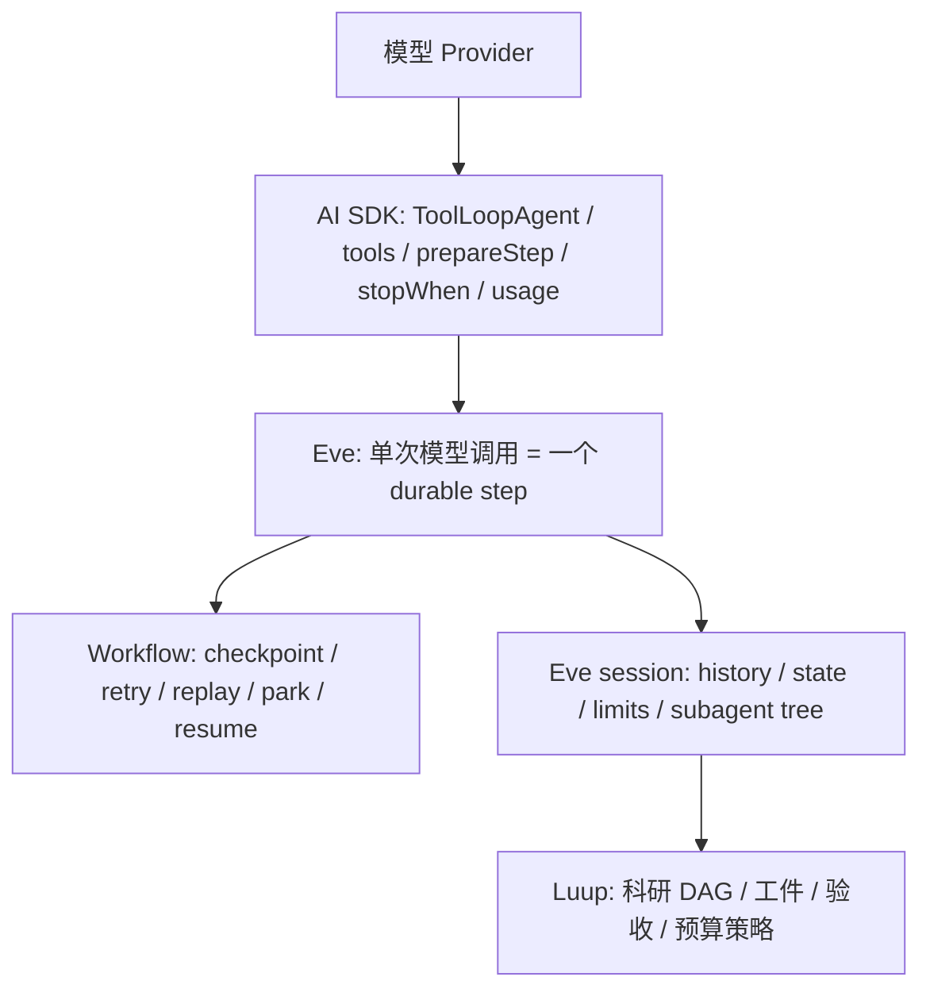

# Vercel Agent 技术栈研究笔记

> **时效注（2026-08-10）**：本文的「一句话结论」（留在 eve + AI SDK 栈上）已被同日的
> 栈迁移决定推翻——用户当日指令明确目标栈为 OpenAI Agents SDK，编排层已整体迁至
> `@openai/agents` + `openai` 直连百炼 Responses（见 architecture.md「模型接线」与
> git 历史）。本文保留作 eve/AI SDK 内部机制的调研档案；文中「缺一个逐调用输入投影
> 扩展点」的诉求在新栈对应 `callModelInputFilter` / `sessionInputCallback`。

日期：2026-08-09。范围：Luup 当时安装的 `eve@0.31.3`、`ai@7.0.0-canary.171`，并以 `../oss/eve` 的同版本源码核对实现。`../oss/ai` 当前是 `ai@7.0.58`，仅用于观察上游方向；涉及 Luup 的 API 判断一律以 `node_modules/ai` 为准。

## 一句话结论

Eve 不是 AI SDK 的替代品，而是把 AI SDK 的单进程 tool loop 拆成可持久化的一步一调用，并在外层接管继续、暂停、重试、重放、子会话和总预算。Luup 应继续站在 `AI SDK primitives → Eve durable harness → Luup domain policy` 这条栈上；当前真正缺少的是一个公开、确定性的“逐模型调用输入投影”扩展点，不是更换框架。



## 1. AI SDK 提供什么

### 1.1 Tool loop 原语

`ToolLoopAgent` 默认用 `isStepCount(20)` 防止无限循环；`stopWhen` 可以组合步数、工具调用或自定义条件。自定义条件收到此前全部 `steps`，所以可按累计 `usage` 实现 token/成本停止条件。

证据：

- `/Users/edward/Documents/luup/node_modules/ai/src/agent/tool-loop-agent.ts:36-36,127-127`
- `/Users/edward/Documents/luup/node_modules/ai/docs/03-agents/04-loop-control.mdx:15-29`
- `/Users/edward/Documents/luup/node_modules/ai/docs/03-agents/04-loop-control.mdx:101-145`

### 1.2 `prepareStep` 是逐步变换器

每次模型调用前，`prepareStep` 收到当前模型、步骤编号、历史步骤、instructions、messages、tool/runtime context 和 sandbox；它可覆盖 model、tool choice、active tools、tool order、instructions、messages、contexts、sandbox 与 provider options。messages/instructions/context 的覆盖会成为后续步骤的基底，而非仅影响当前一次调用。

证据：

- `/Users/edward/Documents/luup/node_modules/ai/src/generate-text/prepare-step.ts:16-94`
- `/Users/edward/Documents/luup/node_modules/ai/src/generate-text/prepare-step.ts:96-177`
- `/Users/edward/Documents/luup/node_modules/ai/src/generate-text/stream-text.ts:1710-1779`

这意味着 AI SDK 层原生足够实现预算状态栏、阶段性工具裁剪、动态模型选择和上下文压缩。但这些原语本身只管理一次内存中的 agent run；durability 不是 `ToolLoopAgent` 的职责。

## 2. Eve 如何重新拥有循环

### 2.1 Eve 把 AI SDK 内循环固定为一步

Eve 每次构造 `ToolLoopAgent` 时传入自己的 `prepareStep`，并固定 `stopWhen: isStepCount(1)`。随后调用 `agent.stream({ messages })`，所以一个 AI SDK run 只完成一次模型调用及其工具调用。

证据：

- `/Users/edward/Documents/oss/eve/packages/eve/src/harness/tool-loop.ts:1043-1082`
- `/Users/edward/Documents/oss/eve/packages/eve/src/harness/tool-loop.ts:1097-1115`

Eve 再根据本步结果决定外层下一状态：若末尾是工具结果、provider 结果要求继续或存在 deferred input，则返回下一 durable step；否则完成 task 或停泊 conversation。历史按追加方式增长，只有 compaction 会重写历史。

证据：

- `/Users/edward/Documents/oss/eve/packages/eve/src/harness/tool-loop.ts:2204-2232`
- `/Users/edward/Documents/luup/node_modules/eve/docs/concepts/default-harness.md:6-21`

因此 Eve 的 `isStepCount(1)` 不是“Agent 只能走一步”，而是把循环控制权从 AI SDK 内存循环提升到 durable workflow。

### 2.2 Eve 当前内部 `prepareStep` 的职责

Eve 的 `buildStepHooks()` 将 AI SDK `prepareStep` 用于发送 `step.started` 以及追加 prompt-cache/provider metadata；compaction 在进入 `agent.stream()` 前由 Eve 外循环完成，以保证用于重建 session history 的消息与真正发给模型的消息一致。

证据：

- `/Users/edward/Documents/oss/eve/packages/eve/src/harness/step-hooks.ts:132-178`

这是一项重要边界：直接在 Eve 内部 `prepareStep` 随意改消息，可能破坏 checkpoint 后的 session history、replay 一致性和前缀缓存假设。公开扩展不能只是把 AI SDK callback 原样透传。

## 3. Durability、retry 与 replay

Eve 的层级是 session → turn → step；一个 step 包含一次模型调用及其产生的工具调用。每个 step 边界持久化 workflow 与 authored state。进程崩溃后，已完成步骤读取记录结果而不重跑；中断中的步骤会重跑，所以有副作用的工具仍需幂等或审批。

证据：

- `/Users/edward/Documents/luup/node_modules/eve/docs/concepts/execution-model-and-durability.mdx:6-18`
- `/Users/edward/Documents/luup/node_modules/eve/docs/concepts/execution-model-and-durability.mdx:57-67`

模型调用另有分类重试：每次 retry 都重建 fresh step hooks；subagent 对 transient provider failure 最多做三次当前未提交调用重试，较早已提交步骤不重跑。

证据：

- `/Users/edward/Documents/oss/eve/packages/eve/src/harness/tool-loop.ts:1184-1199`
- `/Users/edward/Documents/luup/node_modules/eve/docs/subagents.mdx:170-174`

所以 Luup 统计“步骤数、调用数、耗时、成本”时必须区分：逻辑 step、model-call attempt、tool call 与 durable retry。把 attempt 全算成 Agent 规划步会误判性能。

## 4. Usage 与硬预算

### 4.1 用量归 Eve 累计

每步完成后，Eve 从 AI SDK usage 提取 input/output/cache token 与 Gateway cost，写入 session 中的 turn/session 累计值，并更新 Workflow run tags。`step.completed` 事件也投影本步 usage。

证据：

- `/Users/edward/Documents/oss/eve/packages/eve/src/harness/tool-loop.ts:1441-1479`
- `/Users/edward/Documents/oss/eve/packages/eve/src/harness/step-hooks.ts:299-312`
- `/Users/edward/Documents/oss/eve/packages/eve/src/harness/step-hooks.ts:391-431`
- `/Users/edward/Documents/luup/node_modules/eve/docs/guides/instrumentation.md:129-150`

### 4.2 硬预算已经是 harness 机制

`limits.maxInputTokensPerSession` / `maxOutputTokensPerSession` 在下一次模型调用前检查累计 provider usage；越界的那次调用会完成，因为精确 usage 只能事后获得。可交互 root session 默认要求用户批准新窗口，无法触达人类的 task/subagent 则失败。

更关键的是，subagent 在 dispatch 时获得父会话剩余额度按同批 child 均分后的份额，child 用量回计 parent，所以 delegation tree 不能突破 root budget。

证据：

- `/Users/edward/Documents/luup/node_modules/eve/docs/agent-config.md:122-170`
- `/Users/edward/Documents/luup/node_modules/eve/docs/agent-config.md:172-180`
- `/Users/edward/Documents/oss/eve/packages/eve/src/harness/session-token-limits.ts:23-103`

裁决：Luup 不应再造 token 计费与树级硬上限。Eve 是硬预算 owner；Luup 只需要定义题目/角色/阶段配额策略，并把 Eve 已拥有的余额投影给模型。

## 5. Context、state 与 subagent

### 5.1 Context 不等于 state

- instructions 是模型始终可见的稳定契约；dynamic instructions 只在 session/turn 边界解析。
- skills 是按需加载的过程知识。
- workspace/sandbox 内容通过工具发现，不整包塞进 prompt。
- `defineState` 是 session-scoped durable working memory，可在工具、hook 等 Eve runtime context 内读写，并在 step 边界持久化。

证据：

- `/Users/edward/Documents/luup/node_modules/eve/docs/concepts/context-control.md:6-36`
- `/Users/edward/Documents/luup/node_modules/eve/docs/concepts/context-control.md:59-84`
- `/Users/edward/Documents/luup/node_modules/eve/docs/guides/state.md:6-45`

`defineState` 不会自动出现在模型上下文中。它只是 harness-owned state；若模型需要“感知余额”，必须显式投影成模型可见内容。

### 5.2 Subagent 是隔离的 durable child session

declared subagent 不继承 parent 的 instructions/tools/connections/skills/sandbox/hooks/state；parent 只能通过 `message` 显式传入上下文。每个 child 有独立 durable session。root built-in `agent` 是例外：复制 root 能力并共享 sandbox，但仍使用 fresh history/state；其 children 不能递归使用 `agent`。

证据：

- `/Users/edward/Documents/luup/node_modules/eve/docs/subagents.mdx:8-26`
- `/Users/edward/Documents/luup/node_modules/eve/docs/subagents.mdx:125-150`
- `/Users/edward/Documents/luup/node_modules/eve/docs/concepts/execution-model-and-durability.mdx:91-97`

这与 Luup 的主从 DAG 一致：父负责预算分配和 handoff，child 只看到自己的任务与份额。无需删除 multi-agent 模式，但必须减少无信息增量的 child 和重复 round。

## 6. 公开扩展点与明确缺口

| 公开面 | 粒度 | 能否改变模型所见 | 合适用途 |
|---|---:|---:|---|
| dynamic instructions | session / turn | 是 | 身份、租户、该轮稳定背景 |
| dynamic tools | session / turn / step | 是（工具面） | 按阶段裁剪或替换工具 |
| `defineState` | step checkpoint | 否，需投影 | durable 计数器、计划、领域状态 |
| hooks | event 后 | 否 | 审计、指标、外部持久化 |
| instrumentation `step.started` | model call | 否，只返回 telemetry runtimeContext | 每次调用 tracing attributes |
| extensions | package 级 | 取决于贡献类型 | 复用 tools/skills/instructions/hooks |

证据：

- dynamic tools 可在 `step.started` 重算，下一次模型调用读取新工具面：`/Users/edward/Documents/luup/node_modules/eve/docs/guides/dynamic-capabilities.md:138-154`
- dynamic instructions 只在 session/turn 解析：`/Users/edward/Documents/luup/node_modules/eve/docs/guides/dynamic-capabilities.md:209-228`
- hooks 是 observe-only：`/Users/edward/Documents/luup/node_modules/eve/docs/guides/hooks.md:6-30`
- instrumentation 可读最终 model input，但返回值只进入 telemetry runtime context：`/Users/edward/Documents/luup/node_modules/eve/docs/guides/instrumentation.md:61-96`
- extensions 只打包既有 authored slots，不新增 harness hook：`/Users/edward/Documents/luup/node_modules/eve/docs/extensions.md:6-43`

当前 public API 没有与 AI SDK `prepareStep` 等价的“逐模型调用修改 instructions/messages/model/generation settings”接口。动态 tool description 确实能偷渡状态，但会污染工具契约与 KV cache，也不能调整 model/output settings；不应作为预算状态栏实现。

## 7. 对 Luup 的直接设计约束

```text
durable facts (Eve-owned)
  = step index + session usage + child grants + authored state

budget policy (Luup-owned pure function)
  = allocate(task complexity, role, remaining global budget, observed value)

model-visible projection (missing narrow seam)
  = phase + remaining steps/tokens + required next behavior
```

1. **硬限制与软感知分开。** Eve limits 决定能否继续；状态栏只帮助无状态模型选择探索或收敛策略，不能成为安全边界。
2. **预算单位不能只有 token。** Eve 已提供 token tree budget，但 Luup 还要维护领域单位：有效检索数、证据覆盖率、reject 次数、剩余 DAG 节点与 wall-clock deadline。
3. **状态栏必须确定性、短小、尾部追加。** 输入只来自 durable state/usage，不能再次调用 LLM；这样才可 replay、可测试并尽量保留 prompt prefix。
4. **不要直接透传任意 `prepareStep`.** 更安全的 Eve 扩展应是窄接口，例如 deterministic `modelContext`/`status` projector，由 Eve 决定插入位置、序列化和 replay 语义；否则 authored callback 可让实际 model input 与持久化 history 分叉。
5. **先向 Eve 补 seam，再考虑绕过框架。** Luup 直接 import AI SDK 自建第二套 loop 会绕开 Eve 的 checkpoint、retry、usage tree、subagent 与 stream 语义，形成两个 harness owner。

## 8. 下一步验证顺序

1. 用现有 run trace 将逻辑 step、attempt、tool、subagent、等待、provider latency 分层计时，回答 10–20 分钟花在哪。
2. 基于 125 题固定场景定义一个纯函数预算分配器和离线回放测试，不先接模型输入。
3. 在 Eve 提议窄 `status projector` API；验收 replay 后输入一致、compaction 后不丢、KV 前缀不被改写、root/child 预算不泄漏。
4. 只有上游 seam 不成立时，才比较局部 fork 与在 Luup 外围实现；不以完整迁移 OpenAI Agents SDK 为默认选项。

## 9. Luup 代表 run 的实测分解

目前只有 `runs/20260808-134046` 同时具有可信的起止时间和完整 `usage.jsonl`，所以以下是 **n=1 的诊断性基线**，不是全 125 题的总体结论。

| 项目 | 实测 |
|---|---:|
| 端到端墙钟 | 18 分 55 秒 |
| 上游模型调用 | 124 次 |
| thinking 调用 | 76 次，相邻响应间隔累计约 846 秒 |
| plain 调用 | 48 次，相邻响应间隔累计约 280 秒 |
| input / output | 2,253,346 / 107,045 token |
| cached input | 1,995,648 token（88.6%） |
| 未命中缓存的 input | 257,698 token |

证据：

- 起止时间：`/Users/edward/Documents/luup/runs/20260808-134046/meta.json`
- 逐调用时间和 usage：`/Users/edward/Documents/luup/runs/20260808-134046/usage.jsonl`
- 现有汇总交叉验算：`/Users/edward/Documents/luup/scripts/selftest-metrics.ts:111-114`

墙钟分类按“上一个 usage 响应落盘到本响应落盘”的间隔归因，其中会混入工具执行时间，不是精确 provider latency。但数量级已足以否定两个弱假设：

1. **不是 arXiv 请求占了大部分 19 分钟。** 时间主体在 thinking 模型往返和长输出。
2. **KV cache 不是当前主要矛盾。** 输入命中率已达 88.6%；继续经营缓存无法删掉 124 次往返。

现有 usage 凭证只记录 `thinking`，没有 agent/node/session/attempt/tool 身份：`/Users/edward/Documents/luup/agent/lib/model.ts:94-148`。因此目前不能诚实地将 124 次精确分摊到 M/L/H/C/W。下一次付费实验前应先补身份账本，否则任何“删哪个 Agent 最省”都是猜测。

## 10. 从 Ultra 收敛到 Pro：删除顺序

判据不是“这个功能看起来不重要”，而是：**该步骤是否引入新信息，以及删除后确定性 gate 是否仍然成立。**

### 立即可删（低风险）

1. **删除重复的 campaign memory 检索。** root 的第 0 步已先 `memory_search` 并要求把命中行传给 L，但 L 的 instructions 又规定第一步必须再调一次 `memory_search`。第二次没有新信息，只增加 model→tool→model 往返。保留 root 为唯一 owner，L 只消费 handoff。
2. **删除“为用完预算而检索”的空间。** L 的成功条件是≥8篇、两个 facet；默认路径应是 3 组查询、1 次批量 save、1 次 index check，只在覆盖不足时消费 rescue 额度。现在的 6 search / 3 save / 2 index 应是最大上限，不应成为模型看到的默认套餐。
3. **固定候选假设为 2 个。** 当前 H 产出 2–3 个，C 要对每个做至少 3 条批判并搜 prior art。第 3 个候选会线性放大 C 成本；对固定 125 题的 Pro 版，两个异质候选已足以产生真实选择。

### 必须做配对 ablation 才能删（中风险）

4. **合并 H 与 W 为一个 synthesis specialist。** H 产生假设，W 在 C 引入外部反查后将胜出假设写成 schema。W 本身不引入新信息，更像同一个 synthesis 能力的第二阶段。合并后仍是 master 主从制，仍有 L / S / C 三个 declared subagent，且功能顺序仍是 L → S(假设) → C → S(计划)。是删角色边界，不是改 multi-agent 模式。
5. **关闭 root 的全程 thinking。** root 的大部分动作是派工、原样落盘、调 validator 和写 verdict；这些是编排，不是每步都需要深推理。但 root 还承担语义终审，所以不能凭 n=1 直接关掉；应对同一冻结题集比较 thinking on/off 的 deliverable、返工、调用数和墙钟。长期更好的方案是仅在语义裁决步使用 thinking，但这需要前文的 step-level model/input seam。

### 不删（价值边界）

- **不删 C。** C 的 prior-art 反查引入生成假设时没有的外部信息，是多 Agent 有价值的核心条件。
- **不删 master。** 赛题要求的是主从监督与打回；应删的是 master 的编排税，不是监督边界。
- **不删环外 deterministic verifier。** 环内 `verify_references` 负责给 Agent 反馈以便修复；环外 verifier 使用独立数据通路决定交付。两者目的不同，不是简单重复。
- **不再优化 KV cache。** 当前主要问题是调用数与 thinking 范围，不是前缀未命中。

## 11. 最小试验路线

1. **只补观测身份，不改策略**：每次 request 记录 `agent/node/session/attempt/thinking/start/end/usage/status`，先得到可信基线。
2. **Ablation A**：只删重复 memory search。
3. **Ablation B**：只收紧 L 的默认检索路径，保留条件性 rescue。
4. **Ablation C**：只将 3 假设改为 2 假设。
5. **Ablation D**：H/W 合并为 synthesis specialist。
6. **Ablation E**：root thinking off；若质量退化，不升级。

每次只改一个变量，先用同一冻结 canary 题集做配对比较。决策顺序是：确定性 deliverable 不退化 → 调用数/墙钟/token 显著下降 → 才接受删除。M9 在校准未达标时不参与晋级。
