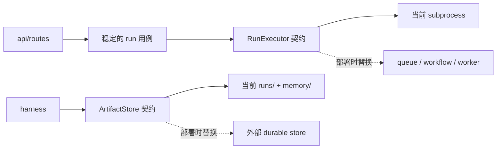

# Python 项目结构基线

> 调研日期：2026-08-10。结论只依据 FastAPI、Vercel、OpenAI 的官方文档和官方仓库；目录名是工程约定，不是框架 API。

## 结论

Luup 当前的 `backend/app/main.py`、`api/main.py`、`api/routes/`、`scripts/`、`tests/` 已经与 FastAPI 官方的大型应用示例及 Full Stack FastAPI Template 对齐。无需为了“像模板”而引入 `core/`、`crud.py`、`models.py`、Alembic、SQLAlchemy、Docker 或认证模块。

应该保留 Luup 自己的领域边界：`domain/`、`agent/`、`data/`。它们表达的是 Luup 的问题，而 FastAPI 模板中的 `crud.py`、`models.py` 表达的是模板自带的 PostgreSQL CRUD 问题，两者不能机械映射。

```text
backend/
├── app/
│   ├── main.py                 # 唯一 FastAPI app 入口
│   ├── api/
│   │   ├── main.py             # 聚合 APIRouter
│   │   └── routes/runs.py      # HTTP 适配层
│   ├── domain/                 # 纯业务契约与规则
│   ├── agent/                  # Agent = Model + Harness，平铺同 eve
│   │   ├── model.py            #   百炼接线（agent 的配置项）
│   │   ├── specialists.py      #   Scientist/Reviewer 组装
│   │   ├── prompts/            #   instructions
│   │   ├── orchestrator.py     #   harness 本体：确定性循环引擎
│   │   ├── artifacts.py        #   harness：工件落盘
│   │   ├── verifier.py         #   harness：零 LLM 确定性验收
│   │   └── tools/              #   模型可见工具，由 harness 执行
│   ├── services/               # 当前 HTTP 用例与本地执行适配
│   └── data/                   # 随应用版本发布的只读静态数据
├── scripts/                    # 开发/构建入口，不参与运行时 import
└── tests/                      # 按 app 边界镜像
```

## 官方结构对照

| 来源 | 官方做法 | 对 Luup 的约束 |
| --- | --- | --- |
| [FastAPI：大型应用](https://fastapi.tiangolo.com/tutorial/bigger-applications/) | `app/main.py` 持有 `app`，功能路由放在子包并通过 `APIRouter` 聚合；建议在 `pyproject.toml` 声明 `app.main:app` entrypoint | 保留 `app/main.py`、`api/main.py`、`api/routes/runs.py`；可补 `[tool.fastapi] entrypoint = "app.main:app"`，无需改入口文件名 |
| [Full Stack FastAPI Template](https://github.com/fastapi/full-stack-fastapi-template/tree/66f444a63a11ce7b4b6df6c4fbe9e15b2fa7aa3a/backend) | `app/main.py` → `app/api/main.py` → `app/api/routes/*.py`；另有面向 SQLModel/PostgreSQL/认证的 `core/`、`crud.py`、`models.py`、Alembic | 只对齐 API 骨架、`scripts/` 和 `tests/`；数据库与认证目录没有需求就不复制 |
| [Vercel：FastAPI 最新部署指南](https://vercel.com/kb/guide/ship-a-fastapi-app-on-vercel) | 零配置扫描 `app.py`、`index.py`、`server.py`、`main.py`、`wsgi.py`、`asgi.py`，位置可在项目根或 `src/`、`app/`、`api/` 下；也允许显式 entrypoint | `backend/app/main.py` 已是可识别入口；未来部署应先实测自动发现，只有 monorepo root 配置无法定位 backend 时才显式声明 entrypoint |
| [Vercel Labs Agents/FastAPI starter](https://github.com/vercel-labs/openai-agents-fastapi-starter/tree/cc6f9e529fed408eb4454e8834fbfaa8eec0ac27) | 为演示部署而把 API、Agent、SSE、Sandbox 全写在根 `app.py` | 它是最小部署示例，不是大型应用目录标准；可借鉴 SSE、Sandbox 生命周期和环境变量检查，不能照搬单文件结构 |
| [OpenAI Agents SDK examples](https://openai.github.io/openai-agents-python/examples/) | 示例按能力分组；简单模式是单文件，`research_bot` / `financial_research_agent` 使用 `main.py`、`manager.py`、`agents/` | 官方没有规定应用目录模板；Luup 的确定性 harness（orchestrator/artifacts/verifier）比照搬 `manager.py` 更准确，`tools/` 继续属于 Harness 执行边界 |

## 当前命名逐项判定

| 当前路径 | 判定 | 理由与后续条件 |
| --- | --- | --- |
| `app/main.py` | 保留 | FastAPI 原生入口；保持只负责装配，不放业务逻辑。它也在 Vercel 最新自动发现名单内 |
| `app/api/` | 已采用并保留 | endpoints 已从 `app/main.py` 下沉，当前 `api/main.py` + `api/routes/runs.py` 已与 Full Stack FastAPI Template 的分层一致 |
| `app/domain/` | 保留 | 模板没有 Luup 的领域模型；不要改成含义更弱的 `models.py` |
| `app/agent/` | 2026-08-10 重排采用（同日拍平） | `Agent = Model + Harness`，目录平铺同 eve——harness 是运行时角色不设子目录：orchestrator/artifacts/verifier 即 harness 本体，`tools/` 是模型可见能力（按调用图归位），model/specialists/prompts 是 agent 配置面 |
| `app/data/` | 保留 | `science125.json` 是版本化、只读的应用数据；它不是数据库，也不是运行状态 |
| `app/services/` | 暂时保留 | 当前只有 HTTP 用例 `RunService` 和本地 `RunLauncher`，尚未复杂到值得搬家；`services` 较泛，新增 durable 实现时再按下节拆分 |
| `backend/scripts/` | 保留 | 与官方模板一致；仅放导出 OpenAPI 等开发/构建命令 |
| `backend/tests/` | 保留并继续镜像 `app/` | `api/domain/agent` 已清楚（`app/` 根的单文件入口如 `cli.py` 对应 `tests/test_cli.py`）；后续应补 `services/` 子目录，而不是把 service 测试塞进 API 测试 |
| `app/cli.py`、`app/evaluation.py` | 暂时保留 | 各自仍是单一入口；只有出现多个 CLI/evaluation 模块后才升格为包 |

## Durable state 的目录接缝

Vercel 将整个 FastAPI 应用部署成一个会横向伸缩的 Function；这不会让本地文件、PID、线程或子进程自动 durable。因此，目录结构现在只需把易变适配器与稳定契约分清，不要预装尚未选定的存储或队列。



建议采用“第二个实现出现时再抽象”的触发条件：

1. 现在不新建空目录、不添加虚构接口。
2. 真正接入 durable store 时，把存取契约放到拥有它的业务边界，而不是 `core/`；本地文件和远端实现作为 adapters。
3. 真正接入远端执行器时，将 `services/launch.py` 拆成稳定的 `RunExecutor` 契约与 `local` / `durable` 实现；API 只依赖契约。
4. `runs/` 和 `memory/` 的语义保持不变：它们是事实数据；即使底层从文件系统迁出，也不能降格为缓存。

## 截图中的依赖不等于应用选型清单

截图来自 [OpenAI Agents SDK README 的 Acknowledgements](https://github.com/openai/openai-agents-python/blob/8979f88873c8032286b679d50bd34ec8cc34c898/README.md#acknowledgements)，描述的是 SDK 自身依赖、可选集成和维护工具，不是在要求使用 SDK 的应用逐项安装。截至调研日，SDK 的[官方 `pyproject.toml`](https://github.com/openai/openai-agents-python/blob/8979f88873c8032286b679d50bd34ec8cc34c898/pyproject.toml)给出的边界如下：

| 技术 | SDK 中的身份 | Luup 是否应直接采用 |
| --- | --- | --- |
| Pydantic | SDK 基础依赖；FastAPI 和 Luup 契约也直接使用 | **是，已使用**；这是应用的直接依赖 |
| Requests | SDK 基础依赖 | **否**；Luup 没有直接调用就让它保持传递依赖，异步 FastAPI 测试继续用 HTTPX |
| MCP Python SDK | 当前 SDK 基础依赖，用于 MCP 能力 | **暂不直接采用**；只有 Luup 要消费或暴露 MCP 时再设计边界 |
| Griffe / `griffelib` | SDK 基础依赖，用于函数工具 schema/docstring 处理 | **否**；属于 SDK 实现细节，不应进入 Luup 业务代码 |
| WebSockets | 当前 SDK 基础依赖，同时服务 realtime/voice 等能力 | **暂不直接采用**；普通 HTTP 与 SSE 不需要 WebSocket，出现双向低延迟需求再引入 |
| SQLAlchemy | SDK 的 `sqlalchemy` extra，用于 SQLAlchemy session | **暂不采用**；只有选 PostgreSQL/SQLite 且需要关系型持久化时再评估。MongoDB 不应套 SQLAlchemy |
| any-llm、LiteLLM | SDK 的两个可选 provider extras | **不采用**；Luup 已有百炼 Qwen 的唯一模型接线，额外 provider 层只会制造双重路由 |
| uv、Ruff | SDK 仓库维护工具 | **是，已使用**；它们也独立满足 Luup 的包管理和 lint 需求 |
| mypy、Pyright | SDK 仓库的开发类型检查器 | **保留 mypy + ty，不加 Pyright**；复制第三个检查器没有新增契约价值 |
| pytest、Coverage.py | SDK 仓库测试工具 | **pytest 已使用；Coverage 暂不加 gate**；应先测试关键行为，不能用覆盖率数字代替质量 |
| MkDocs | SDK 官方文档站构建工具 | **暂不采用**；当前 `docs/` 由仓库直接维护，只有需要独立发布文档站时再选 |

当前 `backend/uv.lock` 已经包含 Requests、MCP、`griffelib`、WebSockets 等 SDK 的传递依赖。把它们再次写入 Luup 的直接依赖不会增加能力，只会错误声明所有权。

## 决策

- **现在执行**：保留现有目录骨架和已经采用的 API 下沉；将 `app.main:app` 视为唯一应用入口；继续使用 uv、Ruff、ty、mypy、pytest。
- **部署到 Vercel 时执行**：先以 `backend/` 为项目根验证 `app/main.py` 自动发现；只有实际 monorepo 检测失败才显式配置 `app.main:app`，不要提前创建重复入口。
- **出现真实需求再执行**：MCP、WebSocket、SQLAlchemy/数据库、Coverage gate、MkDocs、durable store、durable executor。
- **明确不执行**：照搬 Full Stack Template 的 CRUD/认证/Docker 目录；照搬 Vercel starter 的单文件 `app.py`；为兼容 Vercel 创建重复入口；引入 any-llm/LiteLLM 或第三套类型检查器。
